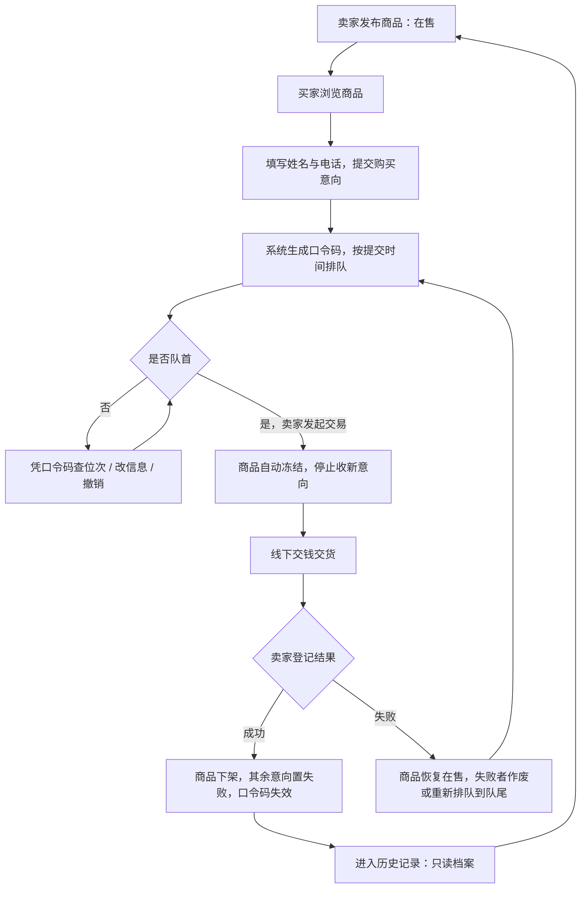

# 需求规格说明书

版本：v1.0（第 1 次阶段性评审），日期 2026-10-08。范围：在线购物系统基线需求（小众定制商品「单品单卖」直销系统）。

- **输入**：课程下发的初始需求条目（带噪声，需澄清）
- **澄清方式**：2026-09-28 由组员丁月诚与需求方逐条访谈澄清，记录见课程 Wiki「需求澄清记录 · 第 4 组 · 何易」
- **用途**：作为设计、开发、测试与验收的统一对照依据

---

## 一、用户角色

| 角色 | 说明 | 是否需要注册 |
| --- | --- | --- |
| 买家 | 浏览当前在售商品；想买时填写姓名与联系电话提交购买意向；凭口令码管理自己的意向 | 否，免注册 |
| 卖家 | 全站唯一的店主，以固定账号登录后台，负责发布商品、处理意向、登记线下交易结果 | 是（用户名 + 密码） |

无第三方角色；本版本不含支付方、配送方与系统定时任务。

---

## 二、功能需求

### FR-01 商品管理

| 编号 | 角色 | 需求描述 | 验收条件 |
| --- | --- | --- | --- |
| FR-01-01 | 卖家 | 发布商品，填写名称、描述、图片、价格 | 名称与价格必填；价格为人民币、大于 0、保留两位小数；描述选填；图片最多 1 张（JPG/PNG，≤5MB），不传则用占位图 |
| FR-01-02 | 系统 | 同一时间在售（含冻结占位）商品最多 1 件 | 已存在在售或冻结商品时，发布请求被拒绝，提示需先完成交易或手动下架 |
| FR-01-03 | 卖家 | 商品修改 | 基线需求不要求修改（如需变更应下架后重新发布）；本版本额外提供了编辑能力，属超出基线的实现，见文末「实现范围说明」 |
| FR-01-04 | 卖家 | 在售状态下可手动下架商品 | 下架后该商品进入历史，买家端不再展示，其在途口令码立即失效 |
| FR-01-05 | 买家 | 查看当前在售商品 | 展示名称、描述、图片、价格；无在售商品时展示空状态「暂无商品在售」 |
| FR-01-06 | 买家 | 查看商品详情 | 商品处于冻结状态时仍可浏览信息，但不提供购买入口，提示「商品交易中」 |

### FR-02 商品状态机

| 编号 | 角色 | 需求描述 | 验收条件 |
| --- | --- | --- | --- |
| FR-02-01 | 系统 | 商品状态共四态 | 在售 / 已冻结 / 已下架 / 已恢复在售；不存在独立的「制作中」或「上架」状态 |
| FR-02-02 | 卖家 | 手动冻结与解冻 | 手动冻结与交易自动冻结共用同一个「已冻结」状态；手动解冻后回到「在售」 |
| FR-02-03 | 系统 | 交易成功置为已下架 | 由「已冻结」直接转「已下架」，无需先解冻 |
| FR-02-04 | 系统 | 交易失败置为已恢复在售 | 由「已冻结」转「已恢复在售」，商品可重新接收意向 |

### FR-03 购买意向与口令码

| 编号 | 角色 | 需求描述 | 验收条件 |
| --- | --- | --- | --- |
| FR-03-01 | 买家 | 提交购买意向 | 姓名、联系电话均必填；无需注册；提交成功返回唯一口令码 |
| FR-03-02 | 系统 | 一意向一码 | 每次提交各生成一个独立口令码；系统不识别同一买家、不做去重，同一人可重复提交 |
| FR-03-03 | 买家 | 口令码只在提交成功页显示一次 | 不提供找回途径；页面提示买家当场保存 |
| FR-03-04 | 买家 | 凭口令码查询意向状态 | 可查当前排队位次与状态（等候中 / 交易中 / 已结束） |
| FR-03-05 | 买家 | 凭口令码修改联系方式 | 仅可修改姓名与联系电话；修改后排队位次不变 |
| FR-03-06 | 买家 | 凭口令码撤销意向 | 排队中可撤销，撤销后其后位次依次前移 |
| FR-03-07 | 系统 | 口令码失效规则 | 交易结束（成功或失败）或商品下架后立即失效，无缓冲期 |
| FR-03-08 | 卖家 | 卖家侧不可见口令码 | 后台意向列表不返回、不显示口令码，也没有任何与之挂钩的标识 |

### FR-04 先到先得队列与交易

| 编号 | 角色 | 需求描述 | 验收条件 |
| --- | --- | --- | --- |
| FR-04-01 | 系统 | 按提交时间正序排队 | 最早提交者位次为第 1 位；不要求其他排序方式，不做时间倒序 |
| FR-04-02 | 卖家 | 只能与队首意向开始交易 | 对非队首执行交易被拒绝，提示「请先到先得：只能与排在最前面的意向人交易」 |
| FR-04-03 | 系统 | 开始交易时商品自动冻结 | 进入交易即置为「已冻结」，并停止接收新意向，提示「商品交易中，暂不接受新的购买意向」 |
| FR-04-04 | 卖家 | 登记交易成功 | 商品转「已下架」；该意向终态为「成功」；其余等候意向自动置为「失败」 |
| FR-04-05 | 卖家 | 登记交易失败 | 商品转「已恢复在售」；失败意向由卖家进一步确认「作废」或「重新排队」 |
| FR-04-06 | 系统 | 重新排队 | 沿用原口令码（口令码绑定买家，不随排队次数变），位次重置到队尾（提交时间刷新），卖家历史按新时间另记一条 |
| FR-04-07 | 系统 | 失败后队列自动递补 | 失败处理完成后，下一位等候者按序自动递补 |
| FR-04-08 | 系统 | 意向终态共三类 | 成功 / 失败 / 撤销；「重新排队」不单列为终态 |

### FR-05 卖家后台

| 编号 | 角色 | 需求描述 | 验收条件 |
| --- | --- | --- | --- |
| FR-05-01 | 卖家 | 使用账号密码登录 | 固定卖家账号；未登录访问后台接口返回 401 并提示未登录或登录过期 |
| FR-05-02 | 卖家 | 修改登录密码 | 需校验原密码；新密码长度不少于 8 位 |
| FR-05-03 | 卖家 | 商品管理 | 发布商品、查看商品列表与历史、手动冻结 / 解冻、手动下架 |
| FR-05-04 | 卖家 | 查看意向购买人列表 | 展示姓名、联系电话、意向提交时间与交易结果，按先到先得顺序排列；需能看到全部意向人，而非只有第一位 |
| FR-05-05 | 卖家 | 登记交易结果 | 仅「交易成功」「交易失败」两种；失败后另需确认对失败者「作废」或「重新排队」 |
| FR-05-06 | 卖家 | 上传商品图片 | 图片上传成功后可被前台商品详情访问 |

### FR-06 历史记录

| 编号 | 角色 | 需求描述 | 验收条件 |
| --- | --- | --- | --- |
| FR-06-01 | 系统 | 历史记录范围 | 收录所有已下架商品（含交易成功下架与卖家手动下架两种来源） |
| FR-06-02 | 系统 | 历史记录内容 | 以商品为单位归档，每个商品下挂其全部意向流水：姓名、联系电话、提交时间、终态（成功 / 失败 / 撤销）；不含口令码 |
| FR-06-03 | 卖家 | 历史记录只读 | 不支持修改、编辑、删除 |
| FR-06-04 | 买家 | 买家端不展示已售商品 | 买家侧只能看到当前在售商品，看不到历史商品 |

### FR-07 本期明确不做（范围外）

买家注册登录、购物车、订单模块、线上支付、物流配送、交易评价、商品搜索与分类、冻结超时自动释放、库存数量概念、多卖家与多商品、微信小程序 / 移动端。

---

## 三、业务流程

关键规则说明：

1. 提交意向**不等于**进入交易，只是排队；进入交易才冻结商品。
2. 冻结期间商品仍占「唯一在售」名额，商品详情可浏览但不可购买。
3. 卖家不能跳位选人；第一位退出只有两条路——买家凭口令码撤销，或卖家标记交易失败。
4. 无冻结超时自动释放机制，推进权在卖家。

---

## 四、非功能需求

| 编号 | 类别 | 要求 |
| --- | --- | --- |
| NF-01 | 数据一致性 | 商品状态唯一，冻结 / 恢复操作需避免并发导致的重复冻结或状态错乱 |
| NF-02 | 数据持久化 | 商品、意向与历史记录持久保存，无保留期限 |
| NF-03 | 安全 | 卖家密码加密存储；后台接口需鉴权 |
| NF-04 | 可追溯 | 记录商品创建 / 更新 / 成交时间与意向提交时间 |
| NF-05 | 终端 | 本版本仅 PC 网页端 |
| NF-06 | 运行环境 | 后端 Java + Spring Boot，前端 Vue；默认内置数据库即可运行，无需额外安装数据库 |

---

## 五、初始需求与澄清结论对照

下表逐条对照课程下发的初始需求（编号 1~7 为需求文档的七个条目组）与本次澄清后的最终结论。

| 初始需求条目 | 澄清过程中的问题 | 澄清后结论 |
| --- | --- | --- |
| 1. 商品与在售唯一性 | 只有一件商品，售出后如何再卖？冻结是否占名额？ | 同一时间在售（含冻结）最多 1 件；售出或手动下架后方可发布下一件 |
| 2. 卖家与账号 | 是否多卖家？能否注册？密码有无要求？ | 单卖家固定账号，无注册流程；可改密码，需验原密码且不少于 8 位 |
| 3. 买家与免注册 | 买家信息包含哪些字段？是否需要地址？ | 仅姓名与联系电话，均必填；不需要地址；不做买家账号与去重 |
| 4. 购买意向、口令码与排队 | 口令码是一人一码还是一意向一码？能否找回？卖家能否看到？排队依据？ | 一意向一码；只在提交成功页显示一次、不支持找回；卖家侧完全不可见；按提交时间正序先到先得 |
| 5. 交易与冻结 | 谁触发冻结？成功后是否要先解冻？失败后如何？卖家能否跳位？ | 与队首开始交易时自动冻结（卖家也可手动冻结，同一状态）；成功后直接下架；失败后恢复在售；严格先到先得，不可跳位 |
| 6. 卖家后台 | 后台需要哪些功能？卖家能否修改意向？ | 登录、改密、发布商品、商品列表与历史、意向列表、冻结 / 解冻、下架、登记交易结果；卖家对意向只能查看，不能修改 |
| 7. 历史记录 | 记录范围与内容？重新排队如何记？买家能否看历史？ | 范围为全部已下架商品（按商品归档）；每条意向记姓名、电话、提交时间与终态，不含口令码；重新排队沿用原口令码并刷新提交时间，另记一条；历史只读，买家不可见 |

### 澄清中被推翻或修正的初始表述

1. 初始需求曾设想「一条意向名下多条失败记录」，澄清后改为「多条独立意向记录，各自只有终态（成功 / 失败 / 撤销）」。
2. 初始需求中「重新排队生成新口令码」被修正为「口令码绑定买家、不随排队变化」。
3. 初始需求对历史记录的分类（已售 / 曾失败）存在冲突，澄清后统一为「全部已下架商品的档案」。
4. 初始需求未明确冻结期间是否接收新意向，澄清后明确为「不接收」。

---

## 六、实现范围说明（超出基线的额外实现）

下表列出本版本实现中**超出上述基线需求**的部分，用于说明「需求文档 ↔ 代码实现」的对应关系，避免验收时产生歧义。

| 项 | 基线需求 | 本版本实现 | 影响与说明 |
| --- | --- | --- | --- |
| 商品编辑 | 不要求支持修改 | 提供 `PUT /api/seller/products/{id}`，后台可编辑名称、描述、图片、价格、分类 | 便于卖家修正笔误；不改变商品四态状态机的流转规则 |
| 商品分类 | 不做商品搜索与分类 | 商品含 `category` 字段，后台可选分类，买家商品详情页展示分类标签 | 仅作展示标签，不提供按分类检索商品的能力 |
| 数据统计 | 不要求人数统计 | 提供 `GET /api/seller/stats`，返回在售数、冻结数、下架数、意向总数与成交数 | 供后台内部使用，当前前端未接入 |
| 意向终态命名 | 成交后其余意向统一记为「失败」 | 其余意向置为 `VOID`（已作废），与 `FAILED`（交易失败）区分 | 命名口径待 Sprint 2 与需求统一 |
